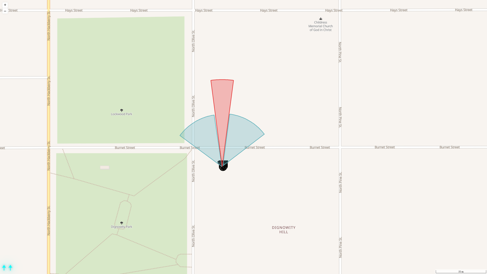
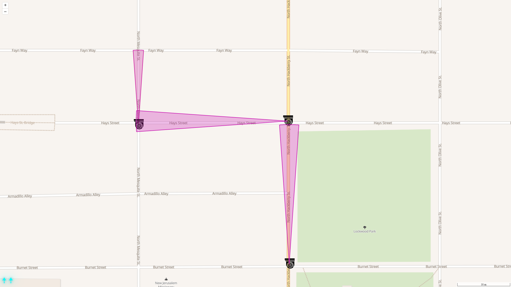
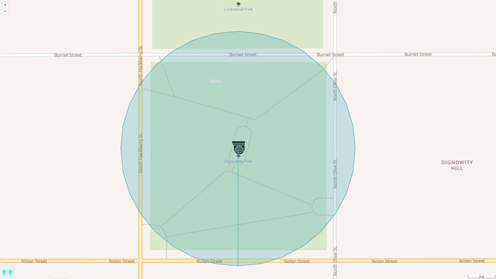

### SurveillanceMapper
Map surveillance cameras in your area. All data is kept on the client device.
Works with local or third-party tile providers.

Example Uses:
- Mapping a camera with variable visibility.

- Planning a route.

- Setting 360° coverage radius.

#### Features
- Add and edit cameras: location, orientation, radius, FOV and z-index.
- Save data locally via local GeoJSON files.
- Minimalistic and intuitive UI using toggle and drag and drop controls.

> Note: The app DOES NOT auto-save at all, manual save is required.

#### Setup
1. Download the _client_ folder.
2. Install dependencies:
  `npm install`
3. Modify the _config.json_ file to choose a tile server. This is where you choose a local server or an online provider.
> A list of online providers based on OpenStreetMap can be found on:
  https://wiki.openstreetmap.org/wiki/Raster_tile_providers
4. Build:
  `npm run build`
5. Serve the _dist_ folder with any http server.
6. Open the app with a web client.

---

##### Disclaimer
This project is intended for ethical use only:
- Physical security pentesting.
- Defensive planning and monitoring.
- Forensic use cases.

Not for illegal activities.

##### Icons and Fonts:
- IconFinder, FontAwesome, Google Fonts.

Check individual licenses before redistribution.

> Developed and tested with tileserver-gl (local server) and OSM remote tiles.
